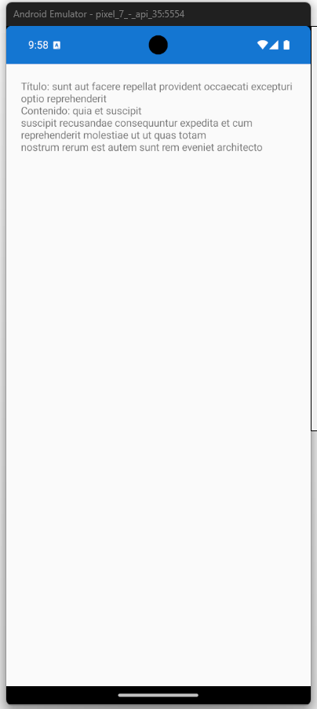

# 📱 Ejemplo Básico de Consumo de API en Xamarin.Forms

Este proyecto demuestra cómo realizar una consulta **sencilla** a una API pública gratuita desde una app Xamarin.Forms, sin necesidad de autenticación ni cuenta. Ideal para pruebas rápidas de conectividad y deserialización JSON.

## 🔗 API utilizada

- **JSONPlaceholder**: Servicio gratuito para simular endpoints REST.
- **Endpoint**: `https://jsonplaceholder.typicode.com/posts/1`
- Retorna un post ficticio en formato JSON.

## 📚 Conceptos Fundamentales

### ¿Qué es una API?

Una **API (Application Programming Interface)** es un conjunto de reglas y protocolos que permite que diferentes aplicaciones se comuniquen entre sí. Es como un "mesero" que toma tu pedido (petición) y te trae la comida (respuesta) desde la cocina (servidor).

### Métodos HTTP más comunes

- **GET**: Obtener/leer datos (como este ejemplo)
- **POST**: Crear nuevos datos
- **PUT**: Actualizar datos existentes
- **DELETE**: Eliminar datos

### ¿Por qué aprender consumo de APIs?

1. **Conectividad**: Las apps modernas necesitan datos externos (clima, noticias, redes sociales)
2. **Eficiencia**: No reinventar la rueda, usar servicios existentes
3. **Escalabilidad**: Separar datos de la interfaz
4. **Colaboración**: Integrar con servicios de terceros
5. **Versatilidad**: Una API puede alimentar web, móvil, desktop

El siguiente diagrama ilustra el flujo básico de consumo de una API desde una aplicación cliente. Comienza con una solicitud HTTP enviada por el frontend (por ejemplo, una app en JavaScript o Xamarin), que llega al servidor de la API. Este servidor procesa la solicitud, accede a los datos necesarios (ya sea desde una base de datos o un servicio externo) y devuelve una respuesta estructurada en formato JSON.


Este flujo es fundamental en aplicaciones modernas que requieren comunicación entre el cliente y servicios remotos. Entender cada etapa —desde la solicitud hasta la respuesta— permite diseñar interfaces más eficientes, manejar errores correctamente y estructurar los datos recibidos para visualizaciones, dashboards o procesamiento adicional.


## 🛠️ Requisitos

- Xamarin.Forms
- Paquete NuGet: `Newtonsoft.Json`

## 📄 Código


### MainPage.xaml

```xml
<ContentPage xmlns="http://xamarin.com/schemas/2014/forms"
             xmlns:x="http://schemas.microsoft.com/winfx/2009/xaml"
             x:Class="ApiDemo.MainPage">
    <StackLayout Padding="20">
        <Label x:Name="resultLabel" Text="Cargando..." />
    </StackLayout>
</ContentPage>
```

### MainPage.xaml.cs

```csharp
// Librerías necesarias
using Newtonsoft.Json;      // Para deserializar JSON
using System.Net.Http;      // Para hacer peticiones HTTP
using Xamarin.Forms;        // Base de Xamarin.Forms

namespace ApiDemo
{
    public partial class MainPage : ContentPage
    {
        // Constructor de la página principal
        public MainPage()
        {
            InitializeComponent();  // Inicializa los componentes del XAML
            GetPost();              // Ejecuta la consulta a la API al cargar
        }

        // Método asíncrono para obtener datos de la API
        private async void GetPost()
        {
            // URL del endpoint que vamos a consultar
            var url = "https://jsonplaceholder.typicode.com/posts/1";
            
            // Creamos el cliente HTTP dentro de using para liberarlo automáticamente
            using (var client = new HttpClient())
            {
                // Hacemos la petición GET y obtenemos la respuesta como string
                var response = await client.GetStringAsync(url);
                
                // Convertimos el JSON string en un objeto Post
                var post = JsonConvert.DeserializeObject<Post>(response);
                
                // Mostramos el resultado en el Label de la interfaz
                resultLabel.Text = $"Título: {post.title}\nContenido: {post.body}";
            }
        }
    }

    // Modelo/clase que representa la estructura del JSON que recibimos
    public class Post
    {
        public int userId { get; set; }     // ID del usuario que creó el post
        public int id { get; set; }         // ID único del post
        public string title { get; set; }   // Título del post
        public string body { get; set; }    // Contenido/cuerpo del post
    }
}
```

## ✅ Resultado Esperado

Al ejecutar la app, se mostrará el título y contenido del post simulado:

```
Título: sunt aut facere repellat provident occaecati
Contenido: quia et suscipit...
```
# 📘 ¿Qué es una Clase en C#? (Ejemplo aplicado)

En C#, una **clase** es una estructura que define un tipo personalizado con propiedades y comportamientos. Sirve como **molde** para crear objetos que representan entidades del mundo real o datos estructurados.

## 🧩 Aplicación en el ejemplo de API

En el ejemplo de consumo de API con Xamarin.Forms, usamos la clase `Post` para **modelar la respuesta JSON** del endpoint `https://jsonplaceholder.typicode.com/posts/1`.

### 🧱 Clase `Post`

```csharp
public class Post
{
    public int userId { get; set; }
    public int id { get; set; }
    public string title { get; set; }
    public string body { get; set; }
}
```

## 🔍 ¿Para qué sirve?

- **Representa** la estructura del objeto JSON recibido.
- Permite **deserializar** la respuesta de la API usando `JsonConvert.DeserializeObject<Post>(...)`.
- Facilita el acceso a los datos mediante propiedades (`post.title`, `post.body`, etc.).

## 🧪 Uso en contexto

```csharp
var post = JsonConvert.DeserializeObject<Post>(json);
Console.WriteLine(post.title); // Muestra el título del post
```



La clase `Post` actúa como un **modelo de datos** que traduce la respuesta de la API en un objeto C# manipulable. Este patrón es común en aplicaciones que consumen servicios web, ya que permite trabajar con datos externos de forma estructurada y segura.

## 📦 Extras

Puedes extender este ejemplo para mostrar múltiples posts en un `ListView`, integrar visualizaciones técnicas o conectar con tus flujos educativos.

## 🔍 Explicación Detallada del Código

### **Puntos clave explicados:**

1. **`using` statements**: Importan las librerías necesarias para HTTP y JSON
2. **Constructor**: Se ejecuta al crear la página y llama automáticamente a `GetPost()`
3. **`async/await`**: Permite hacer la petición sin bloquear la interfaz
4. **`HttpClient` con `using`**: Maneja la conexión HTTP y se libera automáticamente
5. **`JsonConvert.DeserializeObject<Post>`**: Convierte el JSON en un objeto C# tipado
6. **Clase `Post`**: Define la estructura que esperamos del JSON de la API

### **Flujo de ejecución:**

1. App inicia → Constructor → `GetPost()`
2. Petición HTTP a JSONPlaceholder
3. Respuesta JSON se convierte en objeto `Post`
4. Se muestra en el `Label` de la interfaz

### **¿Qué sucede paso a paso?**

1. **Inicialización**: Al abrir la app, se crea `MainPage` y ejecuta su constructor
2. **Petición HTTP**: `HttpClient` envía una solicitud GET al servidor
3. **Respuesta JSON**: El servidor devuelve datos en formato JSON como texto
4. **Deserialización**: `Newtonsoft.Json` convierte el texto JSON en un objeto C# tipado
5. **Visualización**: Los datos se muestran en la interfaz de usuario
   
## **Con mejores Practicas y Control de Errores seria como esto:**

### MainPage.xaml

```xml
<?xml version="1.0" encoding="utf-8" ?>
<ContentPage xmlns="http://xamarin.com/schemas/2014/forms"
             xmlns:x="http://schemas.microsoft.com/winfx/2009/xaml"
             x:Class="App29.MainPage">


    <StackLayout Padding="20">
        <Label x:Name="resultLabel"
               Text="Cargando..."
               FontSize="Medium"
               TextColor="Black"
               VerticalOptions="CenterAndExpand"
               HorizontalOptions="CenterAndExpand" />
    </StackLayout>

```

</ContentPage>


### MainPage.xaml.cs

```csharp
using System;
using System.Net.Http;
using Newtonsoft.Json;
using Xamarin.Forms;
using Xamarin.Essentials;

namespace App29
{
    public partial class MainPage : ContentPage
    {
        public MainPage()
        {
            InitializeComponent();
            GetPost();
        }

        private async void GetPost()
        {
            // Verificar conexión a Internet
            if (Connectivity.NetworkAccess != NetworkAccess.Internet)
            {
                resultLabel.Text = "❌ No hay conexión a Internet.";
                return;
            }

            var url = "https://jsonplaceholder.typicode.com/posts/1";

            using (var client = new HttpClient())
            {
                try
                {
                    var response = await client.GetStringAsync(url);
                    var post = JsonConvert.DeserializeObject<Post>(response);

                    resultLabel.Text = $"🆔 ID del Post: {post.id}\n" +
                                       $"👤 ID del Usuario: {post.userId}\n" +
                                       $"📌 Título:\n{post.title}\n\n" +
                                       $"📝 Contenido:\n{post.body}";
                }
                catch (Exception ex)
                {
                    resultLabel.Text = $"⚠️ Error al obtener el post:\n{ex.Message}";
                }
            }
        }
    }

    public class Post
    {
        public int userId { get; set; }
        public int id { get; set; }
        public string title { get; set; }
        public string body { get; set; }
    }
}


```

# 📱 VISUALIZACIÓN DE POSTS MAS DETALLADA Y CON FILTRO DE LOS 10 POST. 
---

## 🛠️ FUNCIONALIDADES PRINCIPALES NNUEVAS.

- ✅ Verificación de conexión a Internet (`Xamarin.Essentials`)
- 📡 Consumo de API REST con `HttpClient`
- 🧠 Manejo de errores con `try-catch`
- 🎨 Interfaz visual amigable con emojis y estilos
- 🔁 Botón para actualizar manualmente los datos
- 📋 Modelo de datos estructurado (`Post`)
- 📜 ScrollView para visualizar contenido extenso

---

### MainPage.xaml

```xml

<?xml version="1.0" encoding="utf-8" ?>
<ContentPage xmlns="http://xamarin.com/schemas/2014/forms"
             xmlns:x="http://schemas.microsoft.com/winfx/2009/xaml"
             x:Class="App29.MainPage">

    <StackLayout Padding="20">

        <Button Text="🔄 Actualizar Posts"
                Clicked="OnActualizarClicked"
                BackgroundColor="#2196F3"
                TextColor="White"
                CornerRadius="10"
                Margin="0,0,0,10" />

        <ScrollView>
            <StackLayout>
                <Label x:Name="resultLabel"
                       Text="Cargando..."
                       FontSize="Medium"
                       TextColor="Black"
                       VerticalOptions="CenterAndExpand"
                       HorizontalOptions="CenterAndExpand" />
            </StackLayout>
        </ScrollView>

    </StackLayout>

</ContentPage>
```

### MainPage.xaml.cs

```csharp

using System;
using System.Net.Http;
using System.Collections.Generic;
using Newtonsoft.Json;
using Xamarin.Forms;
using Xamarin.Essentials;

namespace App29
{
    public partial class MainPage : ContentPage
    {
        public MainPage()
        {
            InitializeComponent();
            GetPosts();
        }

        private async void GetPosts()
        {
            if (Connectivity.NetworkAccess != NetworkAccess.Internet)
            {
                resultLabel.Text = "❌ No hay conexión a Internet.";
                return;
            }

            var url = "https://jsonplaceholder.typicode.com/posts";

            using (var client = new HttpClient())
            {
                try
                {
                    resultLabel.Text = "⏳ Cargando posts...";

                    var response = await client.GetStringAsync(url);
                    var posts = JsonConvert.DeserializeObject<List<Post>>(response);

                    if (posts != null && posts.Count > 0)
                    {
                        string resultado = "";
                        for (int i = 0; i < Math.Min(10, posts.Count); i++)
                        {
                            resultado += $"🆔 ID del Post: {posts[i].id}\n" +
                                         $"👤 ID del Usuario: {posts[i].userId}\n" +
                                         $"📌 Título:\n{posts[i].title}\n\n" +
                                         $"📝 Contenido:\n{posts[i].body}\n" +
                                         "-------------------------\n";
                        }

                        resultLabel.Text = resultado;
                    }
                    else
                    {
                        resultLabel.Text = "⚠️ No se encontraron posts.";
                    }
                }
                catch (Exception ex)
                {
                    resultLabel.Text = $"⚠️ Error al obtener los posts:\n{ex.Message}";
                }
            }
        }

        private void OnActualizarClicked(object sender, EventArgs e)
        {
            GetPosts();
        }
    }

    public class Post
    {
        public int userId { get; set; }
        public int id { get; set; }
        public string title { get; set; }
        public string body { get; set; }
    }
}


