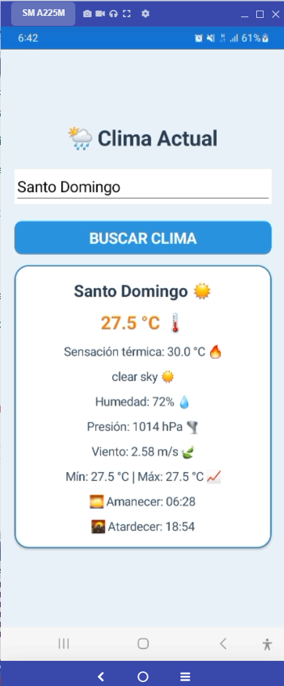
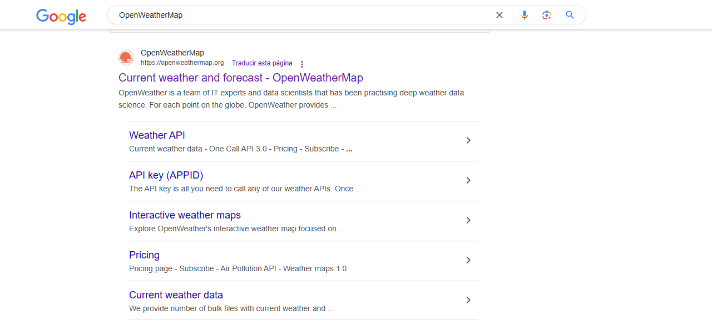
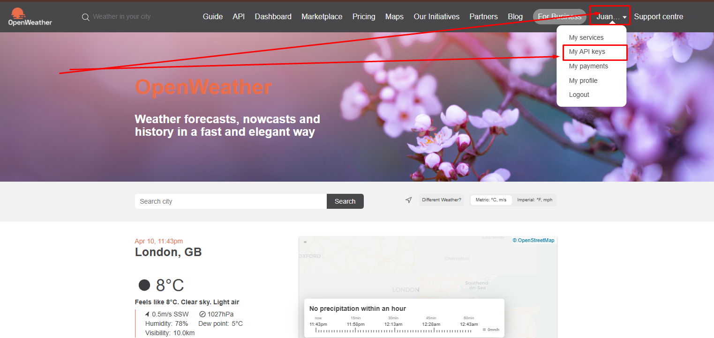
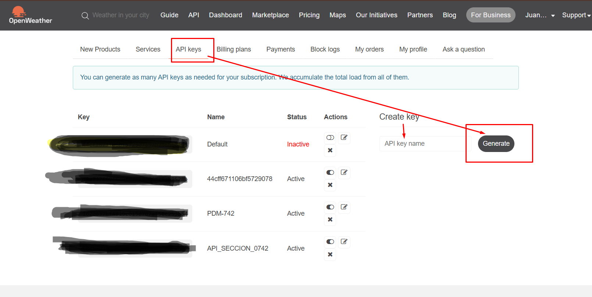

# 📱🌦️ Aplicación del Clima en Xamarin.Forms con OpenWeatherMap ☁️

## 🗺️ Descripción General

El objetivo de este proyecto es crear una **aplicación** intuitiva que permita a los usuarios consultar el **clima** actual de cualquier **ciudad** 🏙️ simplemente ingresando su nombre. Utilizamos **Xamarin.Forms**, un marco de desarrollo multiplataforma que facilita la creación de aplicaciones nativas para **iOS**, **Android** y **Windows** con una única base de código. Para obtener los datos del **clima** en tiempo real, la aplicación se conecta a la **API** de **OpenWeatherMap**, un servicio web confiable y actualizado.

## 🧩 Componentes del Código

### 🎨 Interfaz de Usuario (**UI**)

La **interfaz de usuario** de la aplicación ha sido diseñada para ser limpia y fácil de usar. Se emplea un `StackLayout` para organizar los elementos de forma vertical, asegurando una presentación clara y ordenada.



1. **Logo de la Aplicación**: En la parte superior, se muestra un **logo** 🖼️ representativo de la aplicación, brindando identidad visual.
2. **Entrada de Ciudad**: Justo debajo del logo, se encuentra un campo de texto (`Entry`) donde el usuario puede escribir el nombre de la **ciudad** ✍️ de la que desea conocer el **clima**.
3. **Botón de Búsqueda**: Un **botón** 🔘 claramente visible invita al usuario a iniciar la consulta del **clima**. Al presionarlo, se activa la lógica de la aplicación para obtener y mostrar los datos.
4. **Tarjeta de Clima**: Una vez que los datos del **clima** son recuperados con éxito, se presentan en una **tarjeta de clima** 🎴 (implementada con un `Frame`). Esta tarjeta se despliega en la interfaz y muestra información clave como:
   * **Temperatura Actual** 🌡️
   * **Sensación Térmica** 🥵
   * **Humedad** 💧
   * **Velocidad del Viento** 🌬️
   * Y otros detalles relevantes del **clima** actual.
  
# ✅ Conceptos de API y API REST

## 🌐 ¿Qué es una API?
Una API (Interfaz de Programación de Aplicaciones) es un conjunto de reglas y definiciones que permite a diferentes programas comunicarse entre sí. Las API facilitan la integración de diferentes sistemas y servicios, permitiendo el intercambio de datos y funcionalidades.

## 🏗️ API REST
REST (Representational State Transfer) es un estilo arquitectónico que define cómo las APIs deben estructurarse para ser escalables y eficientes. Una API REST sigue estos principios:

- [x] **Cliente-servidor**: Separación entre cliente y servidor.
- [x] **Sin estado**: Cada petición contiene la información necesaria para procesarla, sin necesidad de recordar estados previos.
- [x] **Cacheable**: Los datos pueden almacenarse temporalmente para mejorar el rendimiento.
- [x] **Interfaz uniforme**: Se utilizan métodos HTTP estándar para la comunicación.

## 🔗 Protocolos en API REST
Los protocolos de comunicación más utilizados en APIs incluyen:

- [x] **HTTP**: Protocolo de transferencia de hipertexto utilizado en la web.
- [x] **HTTPS**: Versión segura de HTTP que cifra la comunicación.
- [x] **WebSockets**: Protocolo para comunicación bidireccional en tiempo real.

# 🛠️ HTTPClient
Es una biblioteca utilizada para realizar peticiones HTTP desde el cliente a una API REST. HTTPClient facilita la comunicación con servidores web, permitiendo el envío de datos y la recepción de respuestas.

# 📝 CRUD en API REST
CRUD se refiere a las operaciones básicas que se pueden realizar sobre los datos:

- [x] **Create** (POST): Crear un nuevo recurso.
- [x] **Read** (GET): Obtener información de un recurso.
- [x] **Update** (PUT/PATCH): Modificar un recurso existente.
- [x] **Delete** (DELETE): Eliminar un recurso.

# ⏳ Peticiones Asíncronas y Sincrónicas
- [x] **Sincrónicas**: La ejecución del código espera la respuesta de la API antes de continuar.
- [x] **Asíncronas**: La ejecución del código no espera la respuesta, permitiendo otras operaciones mientras se obtiene la respuesta.

# 🏛️ Modelo Cliente-Servidor-API
En una arquitectura típica de API:

1. **El Cliente** 🖥️ realiza una solicitud HTTP.
2. **El Servidor** 💾 recibe la solicitud y consulta o modifica los datos.
3. **La API** 🔗 actúa como intermediaria entre el cliente y la base de datos, respondiendo con la información solicitada.

# 🌦️ API del Clima: OpenWeatherMap
OpenWeatherMap es una API REST que proporciona datos meteorológicos. Un ejemplo de solicitud podría ser:

```http
GET https://api.openweathermap.org/data/2.5/weather?q=Santo%20Domingo&appid=TU_API_KEY  
```
# 🧠 Lógica del Código

La lógica principal de la aplicación se centra en la comunicación con la **API** de **OpenWeatherMap** para obtener la información del **clima**.

1. **Solicitud HTTP a la API**: Se inicia una **solicitud HTTP** 🌐 hacia la **API** de **OpenWeatherMap**. Esta solicitud se encarga de pedir los datos del **clima** para la **ciudad** especificada por el usuario.
2. **Uso de HttpClient Asíncrono**: Para realizar la **solicitud HTTP**, se utiliza `HttpClient` en un modo **asíncrono**. Esto es crucial para mantener la **interfaz de usuario** fluida y responsiva, evitando bloqueos mientras la aplicación espera la respuesta de la **API**.
3. **Análisis de Respuesta JSON**: La respuesta de la **API** se recibe en formato **JSON** 📦. El código se encarga de analizar esta respuesta para extraer la información relevante. Se buscan valores específicos como:
   * **Temperatura**
   * **Humedad**
   * **Descripción del Clima** (ej. "Soleado", "Nublado")
   * Otros datos meteorológicos importantes.
4. **Visualización en la UI**: Finalmente, los datos extraídos del **JSON** se utilizan para actualizar la **tarjeta de clima** en la **interfaz de usuario**, mostrando al usuario la información del **clima** de la **ciudad** consultada.

## ☁️ API de OpenWeatherMap

### 🤔 ¿Qué es OpenWeatherMap?

**OpenWeatherMap** es una plataforma online que se destaca por proporcionar datos meteorológicos de alta calidad y en tiempo real para ubicaciones en todo el mundo. A través de su potente **API**, **OpenWeatherMap** pone a disposición de los desarrolladores acceso a una amplia gama de información climática, que incluye:

* **Condiciones Climáticas Actuales** ☀️
* **Pronósticos del Tiempo** 🗓️
* **Datos Históricos del Clima** 🕰️

La **API** permite obtener datos esenciales como **temperaturas**, **humedad**, **presión atmosférica**, **velocidad del viento**, y mucho más, facilitando la creación de aplicaciones del **clima** precisas y completas.







### 🔗 URL Base de la API:

```bash
https://api.openweathermap.org/data/2.5/weather
```

## 💻 Código de la Aplicación

### MainPage.xaml

```xml
<?xml version="1.0" encoding="utf-8" ?>
<ContentPage xmlns="http://xamarin.com/schemas/2014/forms"
             xmlns:x="http://schemas.microsoft.com/winfx/2009/xaml"
             x:Class="App45.MainPage"
             BackgroundColor="#EAF2F8">

 <ScrollView>
    <!-- El contenedor principal que permite desplazar el contenido si es necesario -->
    <StackLayout Padding="20" Spacing="15">
        <!-- Logo y Título -->
        <StackLayout HorizontalOptions="Center" VerticalOptions="Center">
            <!-- Imagen del logo, con especificación de altura y ancho -->
            <Image Source="weather_icon.png" HeightRequest="80" WidthRequest="80"/>
            <!-- Título "Clima Actual" con un ícono de clima y formato personalizado -->
            <Label Text="🌦️ Clima Actual" FontSize="28" FontAttributes="Bold"
                   HorizontalOptions="Center" TextColor="#2C3E50"/>
        </StackLayout>

        <!-- Entrada de texto para ingresar la ciudad -->
        <Entry x:Name="cityEntry"
               Placeholder="🌍 Ingresa una ciudad..."
               PlaceholderColor="Gray"
               FontSize="Medium"
               Margin="0,10"
               BackgroundColor="White"
               TextColor="Black"/>
        <!-- El control Entry sirve para que el usuario ingrese el nombre de la ciudad -->

        <!-- Botón de búsqueda -->
        <Button x:Name="getWeatherButton"
                Text="Buscar Clima"
                Clicked="GetWeatherButtonClicked"
                BackgroundColor="#3498DB"
                TextColor="White"
                CornerRadius="10"
                FontAttributes="Bold"
                FontSize="Medium"/>
        <!-- El botón de búsqueda permite ejecutar la acción de obtener el clima cuando se hace clic -->

        <!-- Tarjeta de clima, inicialmente oculta -->
        <Frame x:Name="weatherCard"
               IsVisible="false"
               BackgroundColor="White"
               CornerRadius="20"
               Padding="20"
               HasShadow="True"
               BorderColor="#2980B9">
            <!-- Un contenedor con sombra y bordes redondeados que muestra los detalles del clima -->

            <StackLayout Spacing="12" HorizontalOptions="CenterAndExpand">
                <!-- Contenedor vertical que organiza las etiquetas con información del clima -->
                
                <!-- Etiqueta para mostrar el nombre de la ciudad -->
                <Label x:Name="cityLabel" FontSize="22" FontAttributes="Bold" TextColor="#2C3E50" HorizontalOptions="Center"/>
                <!-- Etiqueta para mostrar la temperatura -->
                <Label x:Name="temperatureLabel" FontSize="24" FontAttributes="Bold" TextColor="#E67E22" HorizontalOptions="Center"/>

                <!-- Etiquetas para mostrar más detalles del clima -->
                <Label x:Name="feelsLikeLabel" FontSize="16" TextColor="#34495E"  HorizontalOptions="Center"/>
                <Label x:Name="descriptionLabel" FontSize="16" TextColor="#34495E"  HorizontalOptions="Center"/>
                <Label x:Name="humidityLabel" FontSize="16" TextColor="#34495E"  HorizontalOptions="Center"/>
                <Label x:Name="pressureLabel" FontSize="16" TextColor="#34495E"  HorizontalOptions="Center"/>
                <Label x:Name="windLabel" FontSize="16" TextColor="#34495E"  HorizontalOptions="Center"/>
                <Label x:Name="minMaxLabel" FontSize="16" TextColor="#34495E"  HorizontalOptions="Center"/>
                <Label x:Name="sunriseLabel" FontSize="16" TextColor="#34495E"  HorizontalOptions="Center"/>
                <Label x:Name="sunsetLabel" FontSize="16" TextColor="#34495E"  HorizontalOptions="Center"/>
                <!-- Estas etiquetas mostrarán detalles como la sensación térmica, humedad, viento, etc. -->
            </StackLayout>
        </Frame>
    </StackLayout>
</ScrollView>

</ContentPage>
```

### MainPage.xaml.cs (versión básica)

#### Ahra debemmos instalar la libreria de (Newtonsoft.Json) para Importa el espacio de nombres para trabajar con objetos JSON.

```csharp
using System; // Importa funciones básicas de C#
using Xamarin.Forms; // Librería para crear interfaces móviles con Xamarin
using System.Net.Http; // Permite hacer solicitudes HTTP a la API del clima
using System.Threading.Tasks; // Manejo de tareas asíncronas
using Newtonsoft.Json.Linq; // Facilita el procesamiento de datos JSON
using System.Globalization; // Ayuda a manejar formatos de fecha y hora

namespace App45
{
    public partial class MainPage : ContentPage
    {
        // Clave de API para acceder a OpenWeatherMap
        private const string ApiKey = "xxxx-xxxx-xxxx-xxxx-xxxx-xxxx-xxxx-xxxx";

        // URL base de la API con parámetros para ciudad y clave de API
        private const string ApiUrl = "https://api.openweathermap.org/data/2.5/weather?q={0}&appid={1}&units=metric";

        public MainPage()
        {
            InitializeComponent(); // Inicializa la interfaz de usuario
        }

        // Método que se ejecuta al presionar el botón de obtener clima
        private async void GetWeatherButtonClicked(object sender, EventArgs e)
        {
            string city = cityEntry.Text; // Obtiene el nombre de la ciudad desde la entrada de usuario

            if (string.IsNullOrWhiteSpace(city)) // Verifica que el usuario haya ingresado una ciudad
            {
                await DisplayAlert("Error", "Por favor, ingresa una ciudad.", "OK"); // Muestra un mensaje de error si está vacío
                return; // Termina la ejecución del método
            }

            // Construcción de la URL con la ciudad ingresada y la clave API
            string apiUrl = string.Format(ApiUrl, city, ApiKey);

            using (HttpClient client = new HttpClient()) // Se crea una instancia de HttpClient para la solicitud HTTP
            {
                try
                {
                    string response = await client.GetStringAsync(apiUrl); // Realiza la solicitud HTTP y obtiene la respuesta en formato JSON
                    JObject json = JObject.Parse(response); // Convierte la respuesta JSON en un objeto JObject para procesarla

                    // Extrae la información del JSON
                    string cityName = json["name"]?.ToString(); // Nombre de la ciudad
                    double temperature = json["main"]["temp"].ToObject<double>(); // Temperatura actual
                    double feelsLike = json["main"]["feels_like"].ToObject<double>(); // Sensación térmica
                    int humidity = json["main"]["humidity"].ToObject<int>(); // Humedad en porcentaje
                    int pressure = json["main"]["pressure"].ToObject<int>(); // Presión atmosférica en hPa
                    double windSpeed = json["wind"]["speed"].ToObject<double>(); // Velocidad del viento en m/s
                    string description = json["weather"][0]["description"]?.ToString(); // Descripción textual del clima
                    double tempMin = json["main"]["temp_min"].ToObject<double>(); // Temperatura mínima
                    double tempMax = json["main"]["temp_max"].ToObject<double>(); // Temperatura máxima

                    // Conversión de tiempo de amanecer y atardecer desde formato Unix
                    long sunriseUnix = json["sys"]["sunrise"].ToObject<long>(); // Tiempo de amanecer en formato Unix
                    long sunsetUnix = json["sys"]["sunset"].ToObject<long>(); // Tiempo de atardecer en formato Unix
                    DateTime sunrise = DateTimeOffset.FromUnixTimeSeconds(sunriseUnix).ToLocalTime().DateTime; // Convierte Unix a DateTime
                    DateTime sunset = DateTimeOffset.FromUnixTimeSeconds(sunsetUnix).ToLocalTime().DateTime; // Convierte Unix a DateTime

                    // Determina el emoji basado en la descripción del clima
                    string emoji = GetWeatherEmoji(description);

                    // Asigna los valores a los elementos de la interfaz de usuario con emojis
                    cityLabel.Text = $"{cityName} ☀️"; // Muestra el nombre de la ciudad con un emoji de sol
                    temperatureLabel.Text = $"{temperature:F1} °C 🌡️"; // Muestra temperatura con emoji de termómetro
                    feelsLikeLabel.Text = $"Sensación térmica: {feelsLike:F1} °C 🔥"; // Muestra sensación térmica con emoji de fuego
                    descriptionLabel.Text = $"{description} {emoji}"; // Muestra la descripción del clima con el emoji adecuado
                    humidityLabel.Text = $"Humedad: {humidity}% 💧"; // Muestra humedad con gota de agua
                    pressureLabel.Text = $"Presión: {pressure} hPa 🌪️"; // Muestra presión con emoji de tornado
                    windLabel.Text = $"Viento: {windSpeed} m/s 🍃"; // Muestra velocidad del viento con hoja al viento
                    minMaxLabel.Text = $"Mín: {tempMin:F1} °C | Máx: {tempMax:F1} °C 📈"; // Muestra temperatura mínima y máxima con gráfico
                    sunriseLabel.Text = $"🌅 Amanecer: {sunrise:HH:mm}"; // Muestra hora del amanecer con sol naciente
                    sunsetLabel.Text = $"🌇 Atardecer: {sunset:HH:mm}"; // Muestra hora del atardecer con sol poniéndose

                    weatherCard.IsVisible = true; // Hace visible el contenedor con los datos del clima
                }
                catch (Exception ex)
                {
                    await DisplayAlert("Error", $"Error al obtener el clima: {ex.Message}", "OK"); // Muestra alerta si ocurre un error
                }
            }
        }

        // Método para determinar el emoji según la descripción del clima
        private string GetWeatherEmoji(string description)
        {
            description = description.ToLower(); // Convierte la descripción a minúsculas para facilitar la comparación
            if (description.Contains("clear")) return "☀️"; // Cielo despejado
            if (description.Contains("clouds")) return "☁️"; // Nublado
            if (description.Contains("rain")) return "🌧️"; // Lluvia
            if (description.Contains("snow")) return "❄️"; // Nieve
            if (description.Contains("storm")) return "⛈️"; // Tormenta
            if (description.Contains("fog") || description.Contains("mist")) return "🌫️"; // Niebla
            return "❓"; // Descripción desconocida
        }
    }
}
```

# 🌦 Variación con ciudad por defecto: Santo Domingo

En esta variación, hemos implementado una ciudad por defecto en la aplicación de clima. **Al iniciar, la app mostrará automáticamente el clima de Santo Domingo**, permitiendo que el usuario tenga información climática sin necesidad de ingresar una ciudad manualmente.  

## 🔹 ¿Qué hemos hecho?
- ✅ **Establecemos "Santo Domingo" como ciudad predeterminada**, asegurando que los datos climáticos se carguen en cuanto la app se abre.  
- ✅ **Modificamos el constructor `MainPage()`** para asignar `"Santo Domingo"` al campo de entrada y llamar a `GetWeather()`.  
- ✅ **Refactorizamos la estructura del código**, separando la solicitud de clima en `GetWeather()`, lo que mejora la reutilización y permite actualizar los datos dinámicamente.  
- ✅ **Permitimos que el usuario cambie de ciudad** cuando lo desee, ingresando un nuevo nombre y presionando el botón.  
- ✅ **Mejoramos los mensajes de alerta**, usando **emojis** y textos más intuitivos.  
- ✅ **Optimizamos la experiencia del usuario**, reduciendo pasos innecesarios para obtener información climática rápidamente.  

## 🔍 ¿Qué mejoras vemos con esta actualización?
- 🚀 **Experiencia más fluida**: el usuario **no tiene que ingresar una ciudad inicial** manualmente.  
- 🛠 **Código más modular y reutilizable**, lo que facilita futuras mejoras como geolocalización o historial de búsquedas.  
- 🎨 **Interfaz más atractiva**, gracias a la inclusión de emojis y mensajes más claros.  

Con este ajuste, la app se vuelve **más intuitiva y funcional**. ¿Quieres que agreguemos alguna otra mejora, como el almacenamiento de ciudades favoritas? 😃


### MainPage.xaml.cs (versión mejorada con ciudad por defecto)

#### Ahra debemmos instalar la libreria de (Newtonsoft.Json) para Importa el espacio de nombres para trabajar con objetos JSON.

```csharp
using System;  // Importa el espacio de nombres que contiene clases fundamentales como las excepciones y las conversiones de tipos.
using Xamarin.Forms;  // Importa el espacio de nombres de Xamarin.Forms para trabajar con la interfaz de usuario.
using System.Net.Http;  // Importa el espacio de nombres para realizar solicitudes HTTP.
using System.Threading.Tasks;  // Importa el espacio de nombres para el uso de tareas asincrónicas.
using Newtonsoft.Json.Linq;  // Importa el espacio de nombres de Newtonsoft.Json para trabajar con objetos JSON.
using System.Globalization;  // Importa el espacio de nombres para la manipulación de culturas y formatos específicos.

namespace App45  // Define el espacio de nombres para la aplicación.
{
    public partial class MainPage : ContentPage  // Declara la clase MainPage, que hereda de ContentPage, la cual es una página de la interfaz de usuario en Xamarin.
    {
        private const string ApiKey = "xxxx-xxxx-xxxx-xxxx-xxxx-xxxx-xxxx-xxxx";  // Clave de la API de OpenWeatherMap para acceder a los datos del clima.
        private const string ApiUrl = "https://api.openweathermap.org/data/2.5/weather?q={0}&appid={1}&units=metric";  // URL de la API con el formato para realizar la solicitud del clima.

        public MainPage()  // Constructor de la clase MainPage, se ejecuta al crear la página.
        {
            InitializeComponent();  // Inicializa los componentes de la interfaz de usuario (se genera desde el archivo XAML).

            // Establece "Santo Domingo" como la ciudad predeterminada
            cityEntry.Text = "Santo Domingo";  // Asigna "Santo Domingo" como texto predeterminado al campo de entrada de ciudad.
            GetWeather("Santo Domingo"); // Llama a la función GetWeather para cargar el clima de "Santo Domingo" por defecto.
        }

        private async void GetWeatherButtonClicked(object sender, EventArgs e)  // Función que se ejecuta cuando se hace clic en el botón de obtener clima.
        {
            string city = cityEntry.Text;  // Obtiene el texto ingresado en el campo de ciudad.

            // Verifica si el campo de texto está vacío o contiene solo espacios.
            if (string.IsNullOrWhiteSpace(city))  
            {
                // Muestra una alerta si no se ingresó una ciudad.
                await DisplayAlert("❌ Error", "Por favor, ingresa una ciudad 🗺.", "OK");
                return;  // Detiene la ejecución de la función si no se ingresó una ciudad.
            }

            // Llama a la función GetWeather pasando la ciudad ingresada por el usuario.
            GetWeather(city);  
        }

        private async void GetWeather(string city)  // Función asincrónica que obtiene el clima de la ciudad proporcionada.
        {
            string apiUrl = string.Format(ApiUrl, city, ApiKey);  // Formatea la URL con la ciudad y la clave de la API.
            
            using (HttpClient client = new HttpClient())  // Crea un cliente HTTP para realizar la solicitud.
            {
                try
                {
                    string response = await client.GetStringAsync(apiUrl);  // Realiza la solicitud HTTP y espera la respuesta como cadena.
                    JObject json = JObject.Parse(response);  // Parsea la respuesta JSON a un objeto JObject.

                    // Extrae la información necesaria del JSON.
                    string cityName = json["name"]?.ToString();  // Nombre de la ciudad.
                    double temperature = json["main"]["temp"].ToObject<double>();  // Temperatura en grados Celsius.
                    double feelsLike = json["main"]["feels_like"].ToObject<double>();  // Sensación térmica.
                    int humidity = json["main"]["humidity"].ToObject<int>();  // Humedad en porcentaje.
                    int pressure = json["main"]["pressure"].ToObject<int>();  // Presión atmosférica en hPa.
                    double windSpeed = json["wind"]["speed"].ToObject<double>();  // Velocidad del viento en m/s.
                    string description = json["weather"][0]["description"]?.ToString();  // Descripción del clima (soleado, lluvioso, etc.).
                    double tempMin = json["main"]["temp_min"].ToObject<double>();  // Temperatura mínima.
                    double tempMax = json["main"]["temp_max"].ToObject<double>();  // Temperatura máxima.

                    // Convierte las marcas de tiempo de amanecer y atardecer a DateTime.
                    long sunriseUnix = json["sys"]["sunrise"].ToObject<long>();  
                    long sunsetUnix = json["sys"]["sunset"].ToObject<long>();  
                    DateTime sunrise = DateTimeOffset.FromUnixTimeSeconds(sunriseUnix).ToLocalTime().DateTime;  
                    DateTime sunset = DateTimeOffset.FromUnixTimeSeconds(sunsetUnix).ToLocalTime().DateTime;

                    string emoji = GetWeatherEmoji(description);  // Obtiene el emoji correspondiente según la descripción del clima.

                    // Asignaciones con emojis para mostrar en la interfaz.
                    cityLabel.Text = $"{cityName} ☀️";  // Muestra el nombre de la ciudad con un sol.
                    temperatureLabel.Text = $"{temperature:F1} °C 🌡️";  // Muestra la temperatura con un termómetro.
                    feelsLikeLabel.Text = $"Sensación térmica: {feelsLike:F1} °C 🔥";  // Muestra la sensación térmica con un emoji de fuego.
                    descriptionLabel.Text = $"{description} {emoji}";  // Muestra la descripción del clima con el emoji correspondiente.
                    humidityLabel.Text = $"Humedad: {humidity}% 💧";  // Muestra la humedad con un emoji de gota de agua.
                    pressureLabel.Text = $"Presión: {pressure} hPa 🌪️";  // Muestra la presión con un emoji de tornado.
                    windLabel.Text = $"Viento: {windSpeed} m/s 🍃";  // Muestra la velocidad del viento con un emoji de hoja.
                    minMaxLabel.Text = $"Mín: {tempMin:F1} °C | Máx: {tempMax:F1} °C 📈";  // Muestra las temperaturas mínima y máxima con un gráfico.
                    sunriseLabel.Text = $"🌅 Amanecer: {sunrise:HH:mm}";  // Muestra la hora de amanecer con un emoji de sol naciente.
                    sunsetLabel.Text = $"🌇 Atardecer: {sunset:HH:mm}";  // Muestra la hora de atardecer con un emoji de sol poniente.

                    weatherCard.IsVisible = true;  // Hace visible la tarjeta con la información del clima.
                }
                catch (Exception ex)  // Captura cualquier error que ocurra durante la solicitud HTTP o el procesamiento de datos.
                {
                    // Muestra una alerta con el mensaje de error.
                    await DisplayAlert("❌Error", $"Error al obtener el clima 🥵: {ex.Message}", "OK");
                }
            }
        }

        private string GetWeatherEmoji(string description)  // Función que asigna un emoji basado en la descripción del clima.
        {
            description = description.ToLower();  // Convierte la descripción a minúsculas para hacer la comparación más sencilla.
            if (description.Contains("clear")) return "☀️";  // Clima despejado.
            if (description.Contains("clouds")) return "☁️";  // Nublado.
            if (description.Contains("rain")) return "🌧️";  // Lluvia.
            if (description.Contains("snow")) return "❄️";  // Nieve.
            if (description.Contains("storm")) return "⛈️";  // Tormenta.
            if (description.Contains("fog") || description.Contains("mist")) return "🌫️";  // Neblina o niebla.
            return "❓";  // Emoji desconocido si no se reconoce el tipo de clima.
        }
    }
}
```

## 🛠️ Recomendaciones para Implementación

### Instalación de Dependencias
Antes de comenzar, asegúrate de instalar las bibliotecas necesarias:
- **Newtonsoft.Json**: Instálalo a través del gestor de paquetes NuGet en tu proyecto Xamarin.Forms.

### Obtener Clave API de OpenWeatherMap
1. Regístrate en [OpenWeatherMap](https://openweathermap.org/)
2. Ve a la sección de API Keys
3. Genera una nueva clave API
4. Reemplaza `xxxx: xxxx-xxxx-xxxx-xxxx-xxxx-xxxx-xxxx-xxxx` con tu clave real en el código

### Manejo de Errores
El código incluye un manejo básico de errores. Para mejorar la robustez de la aplicación, considera:
- Implementar reintento automático de solicitudes fallidas
- Manejar diferentes tipos de errores específicos de la API
- Almacenar en caché los datos para acceso sin conexión

### Mejoras de Diseño
Para mejorar aún más la apariencia de la aplicación:
- Agrega imágenes para los iconos del clima en lugar de usar emojis de texto
- Utiliza animaciones para las transiciones entre estados
- Implementa temas oscuros/claros
- Mejora la accesibilidad con tamaños de texto configurables

### Consideraciones Adicionales
- La versión mejorada incluye una ciudad predeterminada que carga al iniciar la aplicación
- Personaliza la ciudad predeterminada según tus necesidades o preferencias regionales
- Considera implementar geolocalización para detectar automáticamente la ubicación del usuario

## 🌟 Conclusión

Este código proporciona una base sólida para una aplicación de clima funcional que utiliza Xamarin.Forms y la API de OpenWeatherMap. Puedes expandir esta aplicación añadiendo más características como pronósticos extendidos, mapas de clima, alertas meteorológicas y mucho más.

La combinación de Xamarin.Forms y OpenWeatherMap ofrece una solución eficiente para desarrollar una aplicación de clima multiplataforma que puede ejecutarse en iOS, Android y Windows con un único código base.

¡Personaliza y amplía este proyecto según tus necesidades específicas y comienza a explorar el mundo del desarrollo de aplicaciones móviles meteorológicas! 🚀
